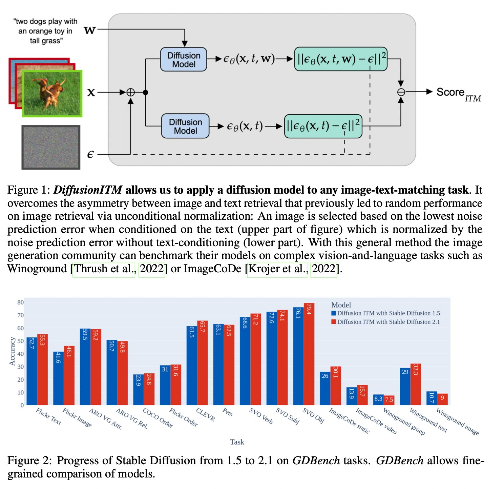

# DiffusionITM
Code and data setup for our paper [Are Diffusion Models Vision-and-language Reasoners?](https://arxiv.org/abs/2305.16397)



We introduce a method to apply Stable Diffusion zero-shot to image-text matching tasks (DiffusionITM), as well as finetune it with hard negatives in a transfer setting (HardNeg-DiffusionITM).
Additionally we introduce GDBench, designed to test various phenomena in discriminative and generative models.

## Setup
IMPORTANT: Clone the repository with the sumbodules option:
```
git clone --recurse-submodules git@github.com:McGill-NLP/diffusion-itm.git
```

Run the following in the diffusers folder:
```
python3 setup.py install
```

Make a new python environment and install the libraries in `requirements.txt`, i.e.:

```
pip install -r requirements.txt
```

 <!-- torch (1.13.0), torchvision (0.14.0), transformers (4.26.1), accelerate (0.16.0), data (2.10.1), spacy (3.5.2), nltk, easydict, tqdm and pandas. -->

If you want to use the ARO benchmark, also run:
```
python -m spacy download en_core_web_sm
```

## Dataset Setup for GDBench

Run `setup.sh` to download images for several of the data (CLEVR, SVO, ImageCoDe, Pets).
If you only want to try a subset of tasks, simply comment out lines, i.e. downloading SVO images can take several hours so only run it if you want to evaluate on SVO.
For the rest, there are some small manual steps:

### Flickr30K

Download the images from [Kaggle](https://www.kaggle.com/data/hsankesara/flickr-image-dataset) and save them under data: `data/flickr30k/images`.

<!-- ### ARO

Nothing to do since the ARO repository will download VG and COCO by itself. -->

<!-- ### Pets
Images: https://thor.robots.ox.ac.uk/~vgg/data/pets/images.tar.gz

### CLEVR

```
wget https://zenodo.org/record/8096756/files/images.zip
```

### SVO

<<<<<<< HEAD
Run data/svo/download.py

### ImageCoDe

wget https://zenodo.org/record/6518944/files/image-sets.zip -->

### Winoground

Fill in AUTH_TOKEN in line 259 of dataset_loading.py

### Bias

We will have instructions for these data soon.

## Experiments

### Zero-shot Image-Text-Matching (DiffusionITM)

We propose a simple method to apply Stable Diffusion to image-text-matching tasks (like Winoground).

The simplest command to get things started:

```
python3 diffusion_itm.py --task winoground
```

You can replace the task name with any other task from: 'winoground', 'mmbias', 'genderbias', 'imagecode', 'imagecode_video', 'flickr30k', 'flickr30k_text', 'flickr30k_neg', 'lora_flickr30k', 'imagenet', 'svo_verb', 'svo_subj', 'svo_obj', 'clevr', 'pets', 'vg_relation', 'vg_attribution', 'coco_order', 'flickr30k_order', 'mscoco', 'mscoco_val'.

To change the default options, here is the complete call:
```
python diffusion_itm.py --task TASK --seed SEED --cuda_device DEVICE --batchsize SIZE --subset --sampling_steps AMOUNT_OF_NOISE_TIMESTEP_SAMPLES_PER_EXAMPLE --img_retrieval --version VERSION_1.5_OR_2.1 --lora_dir ONLY_IF_YOU_LOAD_FINETUNED_WEIGHTS --guidance_scale SCALE
```

### Hard Negative Finetuning (HardNeg-DiffusionITM)

<!-- hard_neg_finetuning.py --pretrained_model_name_or_path /home/nlp/users/bkroje/.cache/huggingface/hub/models--stabilityai--stable-diffusion-2-1-base/snapshots/88bb1a46821197d1ac0cb54d1d09fb6e70b171bc --train_batch_size 4 --gradient_accumulation_steps 4 --neg_prob 1.0 --output_dir mixed_neg1.0_coco_finetuning_lora_savingmodel_lr1e-4 --checkpointing_steps 500 --learning_rate 1e-4 --num_train_epochs 8 --neg_loss_factor 1.0 --mixed_neg -->

On a single GPU:
```
hard_neg_finetuning.py --pretrained_model_name_or_path DIR_OF_SD2.1_IN_CACHE --train_batch_size 4 --gradient_accumulation_steps 4 --output_dir DIR_TO_SAVE_CKPT_AND_LOGS --checkpointing_steps 500 --num_train_epochs NUM_EPOCHS --mixed_neg
```

Via the `--mixed_neg` options, this trains with both hard negative images and texts for a given image-text pair.
The weights for Stable Diffusion 2.1 should be in the cache after running the zeroshot script for example.

If you have multiple GPUs:

```
accelerate launch hard_neg_finetuning.py ...
```

## Citation and Contact
Don't hesitate to reach out to benno.krojer@mila.quebec if you have questions or submit an issue!

We are grateful to many previous code/data we build on top of!
Especially the [Diffusers library](https://github.com/huggingface/diffusers) and the great [repository for the ARO benchmark](https://github.com/mertyg/vision-language-models-are-bows).

If you use our work, please cite us as:

```
@article{krojer2023diffusion,
  title={Are Diffusion Models Vision-And-Language Reasoners?},
  author={Krojer, Benno and Poole-Dayan, Elinor and Voleti, Vikram and Pal, Christopher and Reddy, Siva},
  journal={arXiv preprint arXiv:2305.16397},
  year={2023}
}
```
