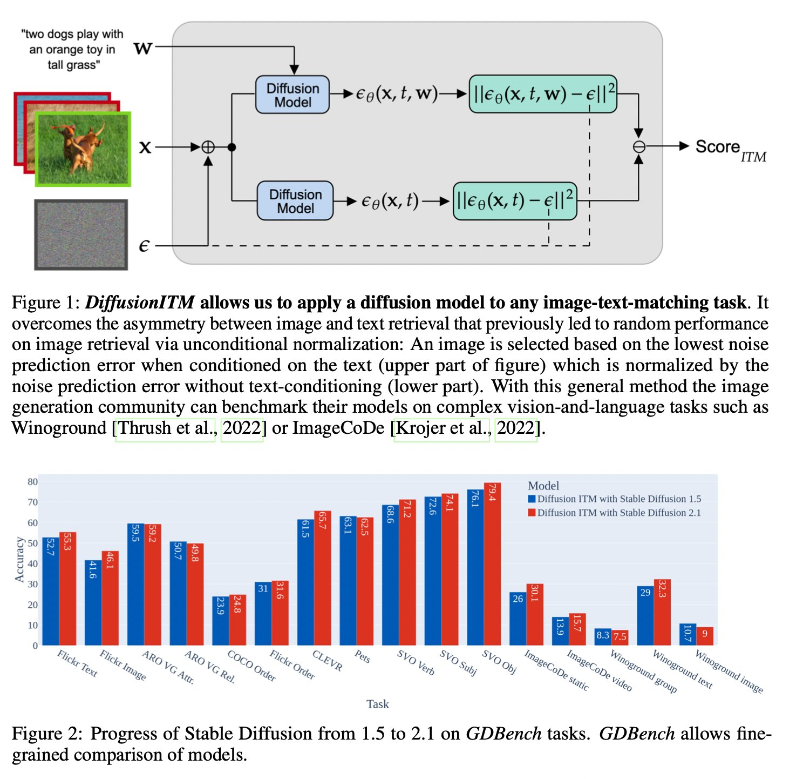

# DiffusionITM
Code and data setup for our paper [Are Diffusion Models Vision-and-language Reasoners?](https://arxiv.org/abs/2305.16397)



Work-in-progress. Code and data will be fully released the next weeks (end of June).

## Setup

Install torch & torchvision.
<!-- Navigate to diffusers and run setup.py install -->

## Dataset Setup

### Flickr30K

Download the images from [Kaggle](https://www.kaggle.com/datasets/hsankesara/flickr-image-dataset) and save them under datasets: `datasets/flickr30k/images`.

### ARO

Nothing to do since the ARO repository will download VG and COCO by itself.

### Pets
Images: https://thor.robots.ox.ac.uk/~vgg/data/pets/images.tar.gz

### CLEVR

```
wget https://zenodo.org/record/8096756/files/images.zip
```

### SVO

Run datasets/svo/download.py

### ImageCoDe

wget https://zenodo.org/record/6518944/files/image-sets.zip

### Winoground

### Bias
